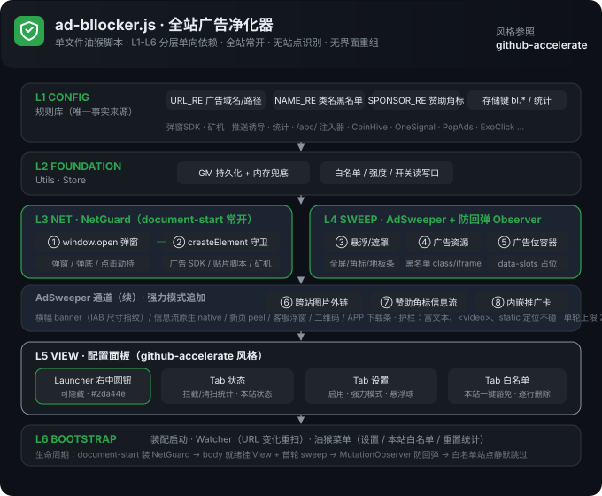

# 全站广告净化器（ad-bllocker.js）

> 单文件油猴脚本。**适配所有网站**，无站点识别、无界面重组——只做一件事：把广告滤干净。配置面板采用 github-accelerate 风格（暗色卡片 + 绿色主题 + 三 Tab）。

## 功能总览

| 通道 | 广告类型（调研来源：IAB 格式体系 / Wikipedia Online advertising） | 识别方式 | 处置 |
|---|---|---|---|
| ① 网络拦截 | 弹窗 Popup / 弹底 Pop-under / 点击弹窗劫持 | `window.open` hook + 广告 URL 指纹 | 拦截并计数 |
| ② 网络拦截 | 广告 SDK / 视频贴片脚本 / 矿机（CoinHive 等）/ 推送诱导（OneSignal 等） | `createElement(script/iframe)` + src setter 守卫 | 命中即丢弃 |
| ③ DOM 清扫 | 全屏遮罩 / 插屏 Interstitial / 悬浮角标 / 底部地板条 / 撕页 peel | fixed 定位 + 几何启发式（面积 ≥90%、宽 ≥75% 视口） | 移除 |
| ③+ DOM 清扫 | 横幅 banner（leaderboard 728×90 / medium rectangle 300×250 等） | fixed + 链接/媒体 + **IAB 标准尺寸指纹**（±8% 容差） | 移除 |
| ④ DOM 清扫 | AdSense 等广告 iframe / script 资源 | `script[src],iframe[src]` 命中 URL 指纹 | 移除 |
| ⑤ DOM 清扫 | 模板广告位（`div[data-slots]` 服务端占位容器） | 属性指纹 + CSS `display:none` 兜底 | 移除 |
| ⑥ DOM 清扫 | 静态图片广告 / 外链横幅 | 跨站绝对外链 + 内容纯图片（站内内容卡均为相对链接） | 隐藏 |
| ⑦ DOM 清扫 | 信息流原生广告的赞助角标（广告/推广/Sponsored） | 文本仅为赞助 token 的小元素 | 移除 |
| ⑧ 强力模式 | 内嵌推广卡 | `a[target=_blank]` + 黑名单指纹 + 含图 | 移除 |

**广告 URL 指纹库覆盖**：Google 系 / 百字系（cpro·hm·cnzz）/ 国内ADX（tanx·mediav·miaozhen）/ 模板注入器（`/abc/`·`/000/`）/ 弹窗联盟（PopAds·PopCash·PropellerAds·ExoClick·Adsterra·HilltopAds·Adcash 等）/ 矿机（CoinHive·CoinImp·Minero·JSEcoin 等）/ 推送诱导（OneSignal·WebPushr·PushNami 等）。

**防回弹**：MutationObserver 防抖重扫，广告动态重新注入即再清除。

**安全护栏**：富文本容器（>200 字符）不碰 · `<video>` 播放器不碰 · static 定位不碰 · 脚本自身 UI 带 `data-bl="ui"` 标记不误杀 · 单轮清扫上限 24 个元素。

## 架构

单文件自顶向下 L1-L6 分层，依赖单向（与 github-accelerate.js 同风格）：



- **L1 CONFIG** — 规则库（URL_RE · NAME_RE · SPONSOR_RE · 存储键 bl.*，唯一事实来源）
- **L2 FOUNDATION** — Utils · Store（GM 持久化 + 内存兜底 · 白名单读写口）
- **L3 NET** — NetGuard：弹窗/注入双拦截（document-start 常开，白名单站点自动休眠）
- **L4 SWEEP** — AdSweeper 八通道清扫 + MutationObserver 防回弹
- **L5 VIEW** — Launcher（右中圆钮）· Panel（状态/设置/白名单三 Tab）· Toast
- **L6 BOOTSTRAP** — 装配启动 · Watcher（URL 变化重扫）· 油猴菜单

## 配置面板（github-accelerate 风格）

- **入口**：右中部绿色圆形悬浮球（可在设置中隐藏，隐藏后从油猴菜单打开）；
- **状态 Tab**：运行状态（运行中/已暂停/白名单）、累计拦截与清扫统计、八通道实时开关指示；
- **设置 Tab**：全局启用、强力模式、显示悬浮球三个开关行 + 立即重扫 + 恢复默认设置；
- **白名单 Tab**：当前站点一键加入/移出，已豁免站点逐行删除；
- 视觉：`#0d1117` 暗色卡片、`#2da44e` 主题绿、圆角 14px 面板、GitHub 风格复选框与按钮，与 github-accelerate.js 同一套设计语言。

## 使用说明

1. Tampermonkey 安装本脚本（`@match *://*/*`，全站常开）；
2. 打开任意网站自动净化：弹窗/注入即时拦截，页面广告由首轮清扫 + 防回弹监听持续清除；
3. 点右中部绿色圆球打开面板，或从油猴菜单进入：可暂停全局、切强力模式、管理白名单；
4. 误伤时把站点加入白名单（面板或油猴菜单均可），该站完全静默零开销。

## 存储键

| 键 | 说明 |
|---|---|
| `bl.enabled` | 全局开关（默认 true） |
| `bl.strong` | 强力模式（默认 false） |
| `bl.launcher` | 显示悬浮球（默认 true） |
| `bl.whitelist` | 白名单域名列表（JSON 数组） |
| `bl.stats` | 累计统计 { blocked, swept } |

## 测试

```bash
node --check ad-bllocker.js
node test-ad-bllocker.js   # 63 项冒烟测试（URL 指纹/悬浮判定/IAB 尺寸/赞助角标/白名单/元数据）
node .tmp/e2e-check.js real.html    # jsdom × 真实页面端到端（WAP 模板）
node .tmp/e2e-check.js real-pc.html # jsdom × 真实页面端到端（PC 模板）
```

## 已知限制

- 墙纸皮肤壁纸、浏览器返回键劫持不处理（非 DOM 层广告）；
- 视频站内嵌播放器内部的贴片广告由 ② 通道在注入层拦截，已渲染的播放器内遮罩不强拆（防误伤播放控制条）；
- 极端布局的悬浮广告可能漏扫（几何启发式以安全优先，宁可漏不误杀）；
- 跨域 iframe 内部广告由浏览器同源策略限制，无法从顶层清理。

## 更新日志

### 2.0.0（2026-09-12）

- 由「视频站净化重组助手」重构转型：**移除站点识别与界面重组**，改为全站常开的纯广告过滤器；
- 广告类型深度调研（IAB 格式体系 + Wikipedia 分类），落地八通道映射，全类型覆盖；
- 新增 IAB 标准广告尺寸指纹（728×90 / 300×250 等 ±8% 容差，fixed + 链接/媒体才动手）；
- URL 指纹库扩充：弹窗联盟（PopAds/ExoClick/Adsterra 等）、矿机（CoinHive 等）、推送诱导（OneSignal 等）；
- 新增通道⑦赞助角标（信息流原生广告）；
- 配置面板全新：github-accelerate 风格（Launcher 右中圆钮 + 居中三 Tab 面板 + Toast），支持白名单逐站管理、强力模式、恢复默认；
- 63 项冒烟测试 + jsdom 真实页面双模板端到端全部通过。

### 历史（video-interface-redesign 1.0.0 - 1.0.4）

- 评分制视频站识别 + 界面重组（已按需求废弃重组能力，识别能力并入本脚本思路）。
