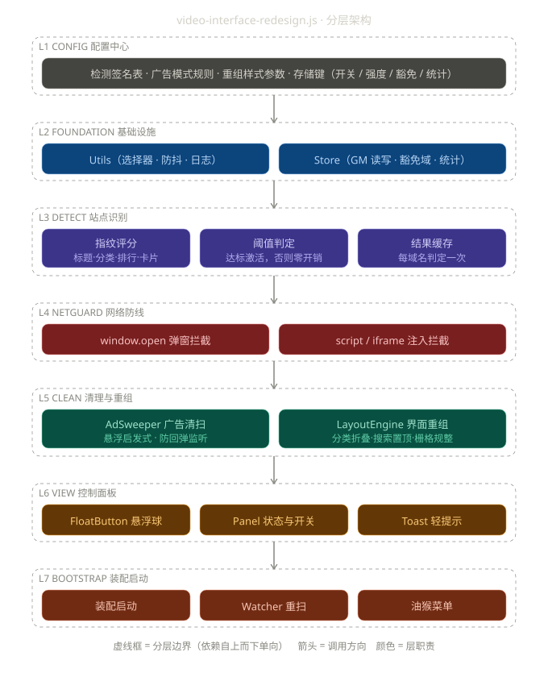

# 视频站界面净化重组助手（video-interface-redesign.js）

> 单文件油猴脚本。**评分制识别**小视频站（不依赖固定域名，换域自动跟随），激活后**四通道清理广告**，并**重组界面**让页面回归清爽：分类折叠、搜索置顶、卡片栅格规整、杂物清理。

## 功能总览

| 防线 | 通道 | 说明 |
|---|---|---|
| 网络拦截 | window.open 弹窗拦截 | 广告 URL 指纹命中即吞掉弹窗 |
| 网络拦截 | script/iframe 注入拦截 | 动态创建的脚本/iframe 设置 src 时实时校验 |
| DOM 清扫 | 悬浮/遮挡清扫 | 全屏遮罩、顶/底横幅、角标悬浮球的几何启发式判定 |
| DOM 清扫 | 防回弹监听 | MutationObserver 防抖重扫，广告重新注入即清除 |
| 界面重组 | 分类导航折叠 | 大分类墙默认收起为 2 行，一键展开/收起 |
| 界面重组 | 搜索栏 sticky | 滚动时搜索栏始终置顶可用 |
| 界面重组 | 卡片栅格规整 | 统一自适应网格、缩略图 16:10 圆角、标题两行截断 |
| 界面重组 | 杂物清理 | 友情链接、公告跑马灯、统计文字等按指纹隐藏 |

## 架构

单文件自顶向下 L1-L7 分层，依赖单向（与 github-accelerate.js 同风格）：



- **L1 CONFIG** — 检测签名表、广告模式规则、重组样式参数、存储键（唯一事实来源）
- **L2 FOUNDATION** — Utils（选择器/防抖/日志）· Store（GM 持久化 + 内存兜底）
- **L3 DETECT** — SiteDetector：快照 → 评分 → 三重硬门槛 → 每域名缓存
- **L4 NETGUARD** — NetGuard：弹窗 + 注入双拦截（document-start 安装，激活后生效）
- **L5 CLEAN** — AdSweeper 清扫 + 防回弹 · LayoutEngine 界面重组
- **L6 VIEW** — FloatButton 悬浮球 · Panel 状态面板 · Toast 轻提示
- **L7 BOOTSTRAP** — 装配启动（body 就绪即判定 · 识别到立刻净化 · 负向重试）· Watcher · 油猴菜单

## 站点识别方案（调研结论）

这类站点（苹果CMS/MacCMS 系模板）域名频繁更换，**固定域名表必然失效**，因此采用 DOM 结构指纹评分制：

| 指纹 | 判据 | 权重 |
|---|---|---|
| 标题指纹 | `<title>` 命中 视频/影视/影院/在线观看 等关键词 | +2 |
| meta 指纹 | keywords/description 命中 | +1 |
| 分类导航 | 单容器内 ≥12 个短文本（≤6 字）直链 | +3 |
| 排行榜 tab | `(热播/总/月/周/日)排行榜` 链接 ≥3 个 | +2 |
| 视频卡片 | ≥8 个「图 + 标题 + 日期」卡片 | +3 |
| 路径指纹 | `/vod /play /type /video` 等典型路径 | +1 |

**激活条件（三重硬门槛，缺一不可）**：

1. 总分 ≥ 7；
2. 导航链接 ≥ 10 且视频卡片 ≥ 6（数量门槛，压制普通资讯站）；
3. 至少命中一个强特征：标题指纹 / 排行榜 / 路径指纹（强特征门槛，压制纯数量拼分的门户页——测试中验证过「meta+大导航+图文卡片」凑 7 分的误报样本）。

判定结果每域名缓存一次；**负向结果不缓存**（内容后到的页面会重试），非目标站点只付出一次快照采集成本，无常驻监听。

## 广告识别方案（调研结论）

| 广告形态 | 识别方式 | 处置 |
|---|---|---|
| 弹窗 | 广告 URL 指纹（doubleclick/googlesyndication/`/ads/`/`/gg/`/guanggao 等正则） | 拦截并计数 |
| 动态注入 | createElement 拦截 + src setter 劫持 | 命中即丢弃 |
| 全屏遮罩 | fixed 定位 + 面积 ≥90% 视口 + 含链接/媒体 | 移除 |
| 顶/底横幅 | fixed + 宽 ≥75% 视口 + class/id 黑名单 | 移除 |
| 角标悬浮 | fixed + 黑名单指纹（ad/gg/banner/float/kefu/downapp 等）+ 含链接/媒体 | 移除 |
| 内嵌推广卡 | 强力模式：`a[target=_blank]` + 黑名单指纹 + 含图 | 移除 |

安全护栏：富文本容器（文本 >200 字符）不碰、含 `<video>` 播放器的元素不碰、单轮清扫上限 24 个元素、脚本自身 UI 带 `data-vir="ui"` 标记不误杀。

## 使用说明

1. Tampermonkey 安装本脚本（`@match *://*/*`，识别制激活，未识别站点零开销）；
2. 打开目标站点：body 一出现即开始判定（100ms 轮询），识别通过**立刻激活**，右下角出现「净」悬浮球；
3. 内容后到的页面（AJAX 渲染）：识别失败不缓存，自动每 2.5 秒重试（约 100 秒上限），就绪即激活；
4. 点悬浮球打开面板：查看识别评分与累计统计、全局开关、清理强度（标准/强力）、本站豁免、**强制激活**、立即重扫；
5. 油猴菜单同款操作。识别失误的站点可「强制激活」跳过识别直接净化，误激活的站点可一键豁免。

## 存储键

| 键 | 说明 |
|---|---|
| `vir.enabled` | 全局开关（默认 true） |
| `vir.strength` | 清理强度：normal / strong |
| `vir.exempt` | 豁免域名列表（JSON 数组） |
| `vir.force` | 强制激活域名列表（JSON 数组，识别兜底） |
| `vir.stats` | 累计统计 { blocked, swept } |

## 测试

```bash
node --check video-interface-redesign.js
node test-video-interface-redesign.js   # 46 项冒烟测试（识别评分/硬门槛/广告正则/悬浮判定/Store 往返/judge 缓存策略）
```

## 已知限制

- 极端布局的悬浮广告可能漏扫（几何启发式以安全优先，宁可漏不误杀）；
- 跨域 iframe 内部广告由浏览器同源策略限制，无法从顶层清理；
- 卡片栅格规整对非标准模板可能无匹配容器（不强改布局）。

## 更新日志

### 1.0.3（2026-09-12）

- **修复真实站点不激活**（端到端复现：cjp.ddsp3.work 评分 7 分卡门槛）：卡片指纹原用 `img.closest('div')` 取盒子——当 img 被内层 `div.log` 包裹而日期在外层 `div.video-foot` 时，最近的 div 里没有日期，卡片恒计 0，硬门槛（cards ≥6）永不满足；改为从 img 逐级上探（≤5 级）寻找「同时含图片与日期」的容器，实测该站评分 7 → 10，自动激活并完成导航折叠/搜索置顶/栅格规整；
- 新增端到端验证手段：jsdom 加载真实站点 HTML × 真实脚本完整启动链路（识别 → 激活 → 重组痕迹断言）。

### 1.0.2（2026-09-12）

- **彻底去 UI**：移除悬浮球与状态面板，识别通过即全自动进入净化模式，页面零侵入（仅保留油猴菜单与 2.2 秒自动消失的轻提示）；
- 移除「强制激活」兜底（`vir.force` 存储键同步删除）——识别到就净化，无需手动干预；
- 新增「无 UI 侵入」测试组，断言脚本不注入任何悬浮球/面板 DOM。

### 1.0.1（2026-09-12）

- 修复「完全无效」：负向识别结果不再永久缓存（此前内容未就绪时判定失败会被缓存住，之后永不重试）；
- 识别到立刻净化：body 就绪即刻判定（100ms 轮询），去掉 300ms 防抖；负向结果每 2.5 秒重试（约 100 秒上限），内容就绪即激活；
- 分类导航指纹改为「短文本叶子链接按 2 级祖先聚桶」，兼容链接被逐个 div 包裹的模板（原 `:scope > a` 直链匹配会数出 0 个导致硬门槛卡死）；
- 界面重组跟随内容后到：MutationObserver 重扫时顺带重跑 LayoutEngine（各步骤幂等）；
- 新增「强制激活本站」兜底（面板 + 油猴菜单），识别失误时跳过识别直接净化。

### 1.0.0（2026-09-12）

- 首版：评分制站点识别（三重硬门槛）、四通道广告清理、四项界面重组、悬浮面板与油猴菜单、41 项冒烟测试全通过。
